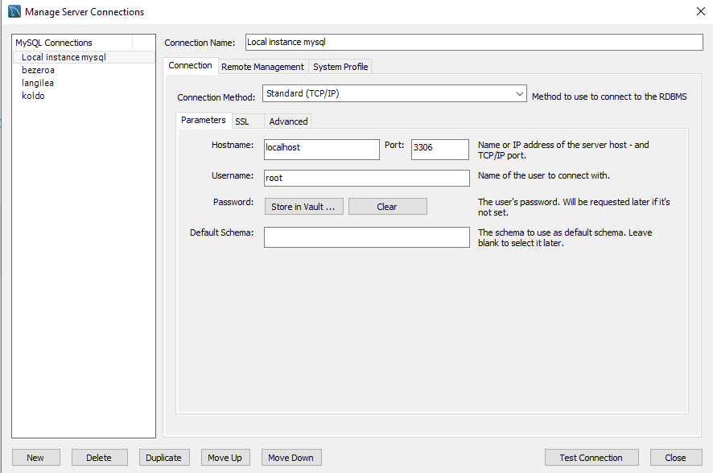
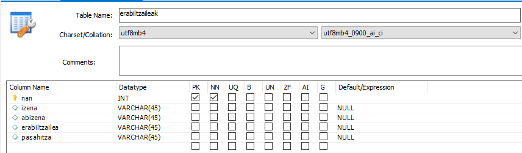

## PROIEKTUA EXEKUTATZEKO PAUSOAK:

1. **Proiektua deskargatu**  
    Lehenik eta behin, `git clone` komandoa erabiliz, proiektua deskargatu behar duzu. Horrela, proiektuaren fitxategiak zure ordenagailuan izango dituzu. Komando hau terminalean exekutatu behar duzu:

    ```bash
    git clone <proiektuaren_git_helbidea>
    ```

2. **Proiektuko karpetara sartu**  
    Proiektua deskargatu ondoren, proiektuko karpetara sartu behar duzu. Horretarako, terminalean `cd` komandoa erabil dezakezu. Adibidez:

    ```bash
    cd proiektuaren_izena
    ```

3. **Proiektua exekutatu**  
    Proiektua exekutatzeko, `mvn` komandoa erabil dezakezu. Adibidez:

    ```bash
    mvn clean install # Proiektua eraikitzeko
    mvn spring-boot:run # Proiektua exekutatzeko
    ```

4. **Datu-basea prestatu**  
    Programak datu-base bat behar du exekutatzeko. Horretarako, datu-base bat aukeratu behar duzu. Nire kasuan `MySQL` erabiliko dut, baina `PostgreSQL` edo `H2` ere erabil daitezke. Aukeratutako datu-basea prestatzeko, jarraitu hurrengo pausoak:

    - **MySQL konexioa sortu lokalean**  
      MySQL zerbitzaria martxan jarri eta konexioa sortu.

      

    - **Datu-basea sortu**  
      Ondoren, `programazioa` izeneko datu-basea sortu behar duzu. Horretarako, `CREATE DATABASE` komandoa erabil ezazu:

      ```sql
      CREATE DATABASE programazioa;
      ```

    - **Taula sortu**  
      Azkenik, `erabiltzaileak` izeneko taula sortu behar duzu. Horretarako, `CREATE TABLE` komandoa erabil ezazu:

      ```sql
      CREATE TABLE erabiltzaileak (
            nan INT PRIMARY KEY NOT NULL,
            izena VARCHAR(100),
            abizena VARCHAR(100),
            erabiltzailea INT,
            pasahitza VARCHAR(100) NOT NULL
      );
      ```

      

## ENUNTZIATUA: Erabiltzaileak Sortu

### P10.01 - Erabiltzaileak Sortzeko Sistema

Aplikazioan alta emateko sistema osatu behar da. Erabiltzaileak honako datuak sartuko ditu:

- **Izena**  
- **Abizena**  
- **NA zenbakia**  
- **Pasahitza**  

### Baldintzak

1. **Pasahitza balidazioa**  
  - Pasahitza bi aldiz sartu behar da.
  - Bi pasahitzak berdinak direla ziurtatu behar da.
  - Pasahitzak gutxienez 6 karaktere izan behar ditu.

2. **Erabiltzaile izenaren sorrera**  
  - Erabiltzaile izena izenaren lehen letra eta abizena erabiliz sortuko da.  
    Adibidez:  
    - *Imanol Zubiaurre* → `izubiaurre`
  - Kasuren batean erabiltzaile izena existitzen bada, izenaren hurrengo letra ere hartuko da:  
    Adibidez:  
    - *Imanol Zubiaurre* → `imzubiaurre`
  - Izen-abizen berdineko erabiltzaileak badaude, zenbaki bi gehituko dira amaieran:  
    Adibidez:  
    - *Imanol Zubiaurre* → `imanolzubiaurre01`

3. **Erabiltzaile berrien zerrenda**  
  - Erabiltzaile berri bat gehitzen denean, erabiltzaile guztiak pantailan listatuko dira.

### Helburua

Sistema hau garatuz, erabiltzaileek modu errazean alta eman ahal izango dute aplikazioan, eta datuen koherentzia eta segurtasuna bermatuko dira.

## ZER FALTA DA PROIEKTUA OSO BUKATZEKO?

* Kodean iruzkinak gehitu
* Klaseak eta metodoak dokumentatu
* Klaseak eta metodoak izendatu ondo
* Klaseak txukundu
