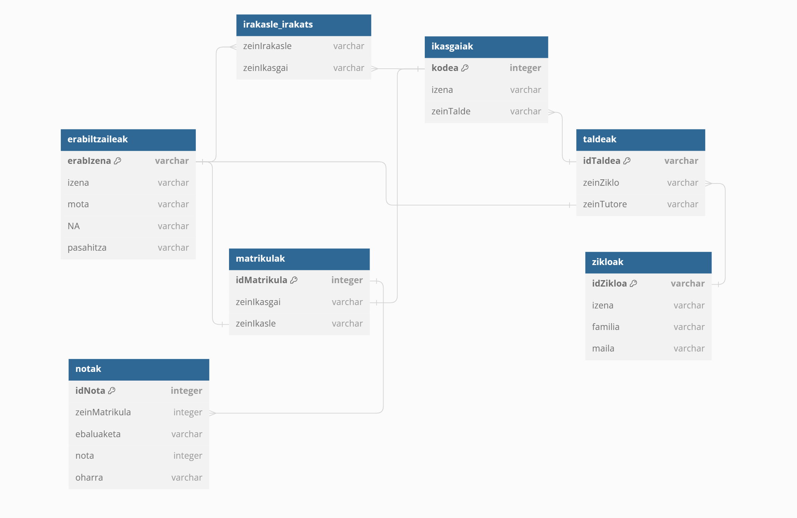

## Java (JDBC): SQL Eragiketak (SELECT, INSERT, UPDATE, DELETE...)

### dependentziak instalatu
```bash
mvn clean install
```

### jar fitxategia eraiki
```bash
java -jar target/notak.jar
```

## 1. P10.03 Notak

Hurrengo datu-base diagrama oinarri hartuta, aplikazioa zabaldu honako funtzionalitateak gehitzeko:

- **Ikasleentzat**: Haien notak ikusi.
- **Irakasleentzat**: Haien irakasgaietako notak sartu.
- **Tutoreentzat**: Haien tutoretzapean dauden ikasleen notak ikusi.

### Datu-base Diagrama



### Nola exekutatu DOCKER-ean

#### Pausoak:

1. **Fitxategiak prestatu**:
    - `Dockerfile`, `docker-compose.yml`, eta `.dockerignore` fitxategiak `docker` karpetan kokatu.
    - `init.sql` fitxategia ere `docker` karpetan kokatu.

2. **Kontainerrak eraiki eta exekutatu**:
    - Terminalean, `docker` karpetara joan eta komando hau exekutatu:
      ```bash
      docker-compose up --build
      ```

3. **Aplikaziora eta datu-basera konektatu**:
    - Aplikazioa eskuragarri egongo da: [http://localhost:8080](http://localhost:8080)
    - Datu-basea eskuragarri egongo da: `localhost:3306`

#### Ohar garrantzitsuak:
- Ziurtatu Docker eta Docker Compose instalatuta eta exekutagarri daudela zure sisteman.
- `init.sql` fitxategiak datu-basearen hasierako konfigurazioa eta datuak eduki behar ditu.
- Portuak (`8080` eta `3306`) beste aplikazioek erabiltzen ez dituztela egiaztatu.

#### Arazoak konpontzeko:
- Arazoak badituzu, kontainerrak gelditu eta berriro exekutatu:
  ```bash
  docker-compose down
  docker-compose up --build
  ```
- Log-ak ikusteko:
  ```bash
  docker-compose logs
  ```
- Portuen erabilera egiaztatzeko:
  ```bash
  docker ps
  ```
- Datu-basea eskuz konektatzeko, adibidez, MySQL Workbench erabiliz:
  - Host: `localhost`
  - Port: `3306`
  - Erabiltzailea eta pasahitza: `init.sql` fitxategian definitutakoak.

